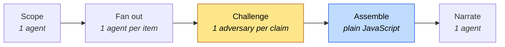

# dynamic-workflows-scenarios

    

> Eight enterprise dynamic-workflow scenarios for Claude Code — reusable subagent
> orchestration scripts that turn multi-week engineering programmes into a single
> auditable run.

[Dynamic workflows](https://code.claude.com/docs/en/workflows) let Claude Code
write a JavaScript orchestration script and execute it in the background, fanning
work out across dozens to hundreds of subagents while intermediate results stay in
script variables instead of a context window.

This repository is a library of scenarios built on that primitive, aimed at the
work enterprises currently do by putting a few senior people in a room with too
little time: audit evidence, regulatory impact, technical due diligence,
decomposition planning, vulnerability triage, incident forensics, cloud cost, and
production readiness.

Every scenario spends roughly half its agent budget on **adversarially verifying
its own findings**, and computes every number it reports in plain JavaScript
rather than asking an agent to remember. That is the difference between a report
you can show an auditor, a CFO or a deal team, and one you cannot.

---

## Quick start

```bash
git clone https://github.com/arananet/dynamic-workflows-scenarios.git
cd dynamic-workflows-scenarios
bash setup.sh     # installs the OpenSpec git hooks
npm test          # runs the offline suite — no dependencies, no tokens
```

To use the scenarios, copy the ones you want into the repository you want to
analyse:

```bash
cp .claude/workflows/cve-blast-radius.js /path/to/your-repo/.claude/workflows/
```

Requires Claude Code v2.1.154 or later, on any paid plan. There is nothing to
install and no package to add — a workflow is a single file.

---

## Usage

A file in `.claude/workflows/` becomes a slash command in that project:

```text
/slo-readiness-audit
```

Arguments are passed in your own words; Claude turns them into the script's `args`
object:

```text
Run /cve-blast-radius for CVE-2026-31337, a deserialisation flaw in acme-parser
before 4.2.1, and cap it at 40 candidates
```

Watch the run with `/workflows` — each phase shows its agent count, token total
and elapsed time, and you can pause, stop or drill into any individual agent.

---

## The eight scenarios

| Scenario | The question it answers | Fan-out |
|---|---|---|
| [`control-evidence-sweep`](.claude/workflows/control-evidence-sweep.js) | Which controls can we actually *prove* to an auditor, and which are gaps? | 1 agent per control, 1 challenger per claim |
| [`reg-change-impact`](.claude/workflows/reg-change-impact.js) | Which of our services does this new regulation touch, and what will it cost? | 1 agent per obligation × service pair (capped) |
| [`ma-code-diligence`](.claude/workflows/ma-code-diligence.js) | What does this codebase change about the price and the first 100 days? | 7 blind risk lenses + reconciliation |
| [`strangler-fig-plan`](.claude/workflows/strangler-fig-plan.js) | How do we take this monolith apart, and why not the other two ways? | 3 rival plans, 6 cross-critiques, scored |
| [`cve-blast-radius`](.claude/workflows/cve-blast-radius.js) | Of the 300 services with this package, in how many is it *reachable*? | 1 analyst per candidate, 1 challenger per hit |
| [`incident-forensics`](.claude/workflows/incident-forensics.js) | What actually caused this, and what did we rule out and why? | 4 hypotheses, 12 cross-examinations |
| [`cloud-cost-hotspots`](.claude/workflows/cloud-cost-hotspots.js) | Where does the cloud bill actually go, with a number we can defend? | 1 agent per surface, 1 re-estimator per hotspot |
| [`slo-readiness-audit`](.claude/workflows/slo-readiness-audit.js) | Which of our ninety unexamined services would we not want to be on call for? | 1 assessor per service, 1 verifier per claimed pass |

Full briefs — business problem, arguments, output shape, cost and limits — are in
**[`docs/SCENARIOS.md`](docs/SCENARIOS.md)**.

---

## The shape they share



Three rules hold across the library, and the test suite enforces all three:

- **Findings are challenged before they are reported.** An agent asked whether it
  found something tends to say yes; a different agent asked to break the finding
  does not. `refuted` and `unverified` outcomes are reported as their own
  categories, never folded into "clean".
- **Numbers are arithmetic, not recollection.** Counts, scores, sort order and
  totals are computed in the script from verified results. The final agent writes
  prose around numbers it cannot change.
- **Fan-out is capped and truncation is reported.** Every scenario with a
  discovery phase bounds its own agent count and tells you what it left out.

---

## Testing without spending tokens

Workflow scripts cannot be imported: they mix `export const meta` with top-level
`await` *and* a top-level `return`, and they read `agent`, `pipeline` and `args`
as globals the runtime injects. So a typo in a phase, an unguarded empty fan-out,
or a cap that does not hold would normally only surface mid-run — after real
tokens had been spent across dozens of subagents.

[`tests/harness.js`](tests/harness.js) emulates the runtime's scripting surface
offline. It compiles a script the way the runtime does, records every agent call,
and synthesises schema-conformant results, so a scenario's real control flow runs
end to end in milliseconds for zero tokens:

```bash
npm test    # 107 tests, no dependencies
```

The suite proves orchestration — fan-out sizing, caps, empty-scope guards, verdict
arithmetic, result shape. It proves nothing about whether the prompts elicit good
answers from real subagents; that needs a live run against a real repository. The
[harness spec](.openspec/specs/workflow-library-harness.spec.yaml) states the
boundary explicitly.

---

## Contributing

This project uses **OpenSpec** for spec-driven development — every feature or
bugfix starts with a spec file under `.openspec/specs/`. Each spec includes a
`roles` block to assign responsibility (`implementer`, `reviewer`, `qa`,
`product_owner`). See [`docs/OPENSPEC.md`](docs/OPENSPEC.md) for the full
workflow, or [`CONTRIBUTING.md`](CONTRIBUTING.md) for the contributor checklist.

A new scenario needs three things: the script in `.claude/workflows/`, a brief in
`docs/SCENARIOS.md`, and a spec. The conformance suite picks the script up
automatically.

### CI

Only two workflows run on push and pull request: **OpenSpec PR Check** (spec
coverage plus the test suite) and **Lint**. The other twenty shipped by the
template — CodeQL, Scorecard, SBOM, release, container and license scanning, DCO,
stale-bot and the rest — are retained as `workflow_dispatch`-only, with their
original triggers kept commented out directly above the replacement. This
repository ships workflow scripts and specs: no build artefacts, no container
images, no published packages, no dependency tree for them to scan. Re-enable any
of them by restoring the commented trigger block.

---

## Documentation

| Topic | Where |
|---|---|
| Scenario briefs | [`docs/SCENARIOS.md`](docs/SCENARIOS.md) |
| Spec-driven workflow | [`docs/OPENSPEC.md`](docs/OPENSPEC.md) |
| Branch protection setup | [`docs/BRANCH_PROTECTION.md`](docs/BRANCH_PROTECTION.md) |
| Architecture decisions | [`docs/adr/`](docs/adr/) |
| Security policy | [`SECURITY.md`](SECURITY.md) |
| Support channels | [`SUPPORT.md`](SUPPORT.md) |
| Release history | [`CHANGELOG.md`](CHANGELOG.md) |

Upstream reference: [Orchestrate subagents at scale with dynamic
workflows](https://code.claude.com/docs/en/workflows).

---

## License

[MIT](LICENSE)

---

[](https://ko-fi.com/H2H51MPWG)
