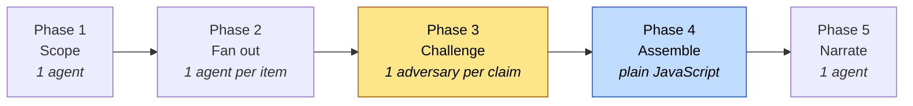
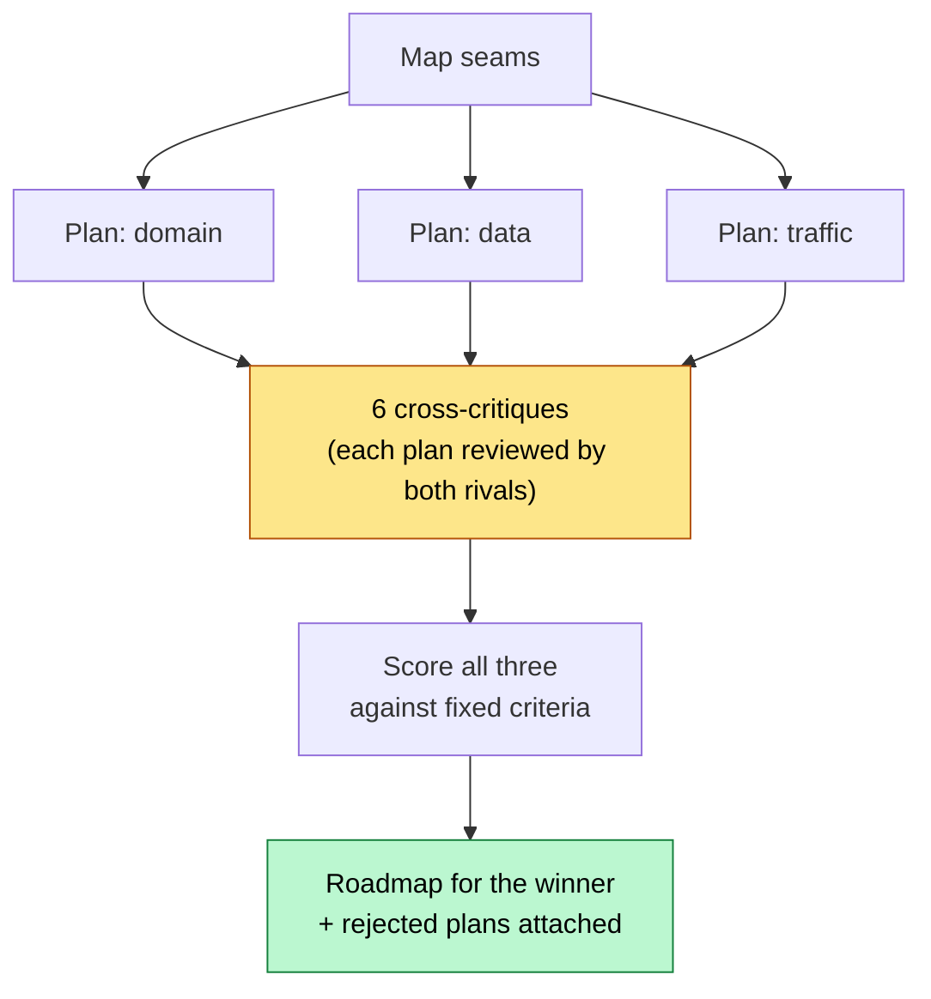
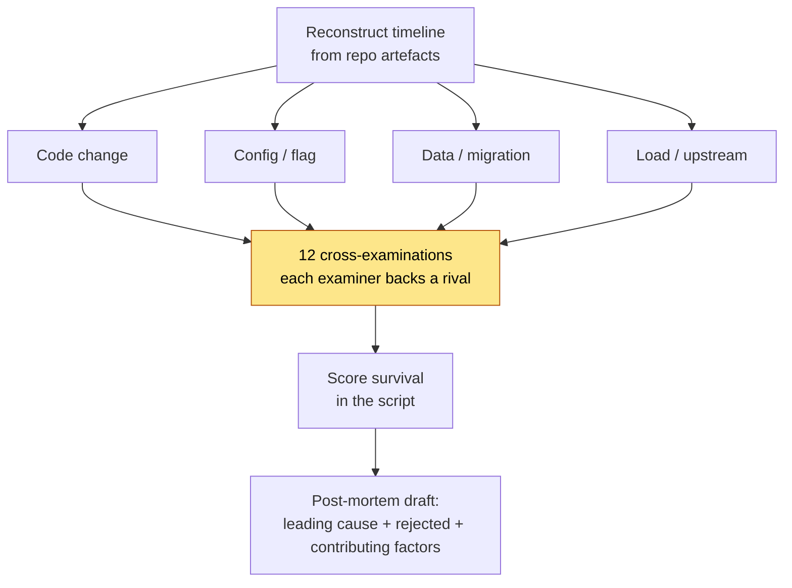

# Scenario catalogue

Eight enterprise dynamic-workflow scenarios. Each is a single JavaScript file in
[`.claude/workflows/`](../.claude/workflows/) that Claude Code's workflow runtime
executes, spawning subagents in parallel and holding the intermediate results in
script variables rather than in a context window.

Each scenario answers a question an enterprise currently answers by putting a
small number of senior people in a room with too little time. They are not
faster versions of what one agent already does well — they exist because
coverage and independent verification are what the serial version cannot buy.

---

## The pattern underneath all eight

Six of the eight follow the same shape, and the shape is the point.



Two design choices recur, and both are deliberate.

**Phase 3 costs roughly as much as phase 2 and is not optional.** An agent asked
whether it found something will tend to say yes. A different agent asked to break
that finding will not. Every scenario that reports a verdict spends a second pass
trying to knock its own findings down, and reports `refuted` and `unverified`
outcomes separately rather than folding them into "clean". An audit that
overstates coverage is worse than no audit.

**Phase 4 is script, not agent.** Counts, scores, sort order and totals are
computed in plain JavaScript from the verified results, so the numbers in the
report are arithmetic rather than an LLM's recollection of what it just read. The
final agent writes the narrative around numbers it cannot change.

Two scenarios (`strangler-fig-plan`, `incident-forensics`) use a different shape —
several independent drafts, cross-examined against each other, then scored — for
problems where the risk is not missing something but committing to the first
plausible story.

---

## Running a scenario

Save a workflow to `.claude/workflows/` (they are already there) and it becomes a
slash command in that project:

```text
/control-evidence-sweep
```

Pass arguments in your own words — Claude turns them into the `args` object:

```text
Run /cve-blast-radius for CVE-2026-31337, a deserialisation flaw in acme-parser
before 4.2.1, and cap it at 40 candidates
```

Watch it with `/workflows`, which shows each phase, its agent count, token total
and elapsed time. `p` pauses, `x` stops, and completed agents' results are cached
if you resume in the same session.

> **Cost.** These runs spawn dozens to low hundreds of agents. Every scenario
> caps its fan-out and reports what it truncated, but the first run on a large
> estate should be a slice — one directory, one service, one obligation — before
> you point it at everything.

---

## Regulated, financial services & compliance

### `control-evidence-sweep`

**The problem.** Twice a year, senior engineers spend weeks proving to an auditor
that a control is actually implemented. The work is mechanically enormous and
intellectually shallow: one investigator can only look in so many places, so the
evidence pack ends up thin in the places nobody had time for.

**What it does.** One investigator agent per control hunts for enforcing evidence
— a file and the lines that make the control true, not a policy document that
nothing enforces. Every claim is then handed to a challenger agent whose brief is
to break it: does the evidence exist, does it enforce or merely describe, can it
be bypassed, does it cover the whole estate. Only claims that survive are reported
as satisfied.

**Why it pays.** The value of an evidence pack is entirely that a third party can
trust it. One overstated control costs the auditor's confidence in every other
control in the pack.

| | |
|---|---|
| `args` | `controls` (list of `{id, name}`), `catalogue`, `period` |
| Defaults | A built-in SOC 2 Common Criteria starter set of 8 controls |
| Agents | `1 + controls + claims + 1` |
| Returns | `coverage` counts, `satisfied`, `gaps` (with refutations kept), `unverified`, `readiness`, `recommendations` |

```text
/control-evidence-sweep for our PCI-DSS 4.0 requirements 3, 6 and 8, covering FY26 Q1-Q2
```

### `reg-change-impact`

**The problem.** A new clause lands. Nobody can say which of 400 services it
touches, so the programme either over-scopes (and costs a fortune) or under-scopes
(and misses the deadline on something nobody looked at).

**What it does.** Decomposes the change into discrete engineering obligations —
things a team can put on a board, not "comply with Article 12" — then ranks
service-by-obligation pairs and assesses the top ones in parallel. Each assessment
returns a status, severity, effort band and the code paths that decide it, and can
report `not-applicable` to remove a service from scope. A removed service is as
valuable as an added one.

**Why it pays.** It converts a regulation into a staffable backlog with a critical
path, which is the artefact the programme actually needs and the one that takes
longest to produce by hand.

| | |
|---|---|
| `args` | `change`, `regime`, `deadline`, `maxAssessments` (default 60) |
| Agents | `2 + min(candidates, maxAssessments) + 1` |
| Returns | `obligations`, `backlog` (severity-ordered), `impacted`, `outOfScope`, `deadlineOutlook`, `criticalPath`, `truncated` |

```text
/reg-change-impact DORA Article 19: ICT-related incidents must be reported to the
competent authority within 4 hours of classification. Deadline 2027-01-17.
```

---

## Legacy modernization & M&A

### `ma-code-diligence`

**The problem.** A deal team has two weeks to decide what a codebase is worth.
They sample a fraction of it, and the things that surface post-close — an AGPL
dependency in the core, a live credential in git history, one engineer who owns
the settlement engine — are the ones nobody had time to look for.

**What it does.** Seven independent risk lenses, one agent each, deliberately
blind to one another: licensing and IP, secret hygiene, dependency end-of-life,
engineering and release maturity, architecture and coupling, key-person
concentration, and data-protection exposure. A reconciliation agent then sees
everything at once and sorts findings into deal-breaker, price-adjusting and
post-close.

**Why it pays.** Keeping the lenses blind is what makes the reconciliation
meaningful: when two lenses independently point at the same problem, that is
corroboration. If they could read each other, it would only be correlation.

| | |
|---|---|
| `args` | `target` (default `.`), `dealContext`, `lenses` |
| Agents | `1 + lenses + 1` |
| Returns | `recommendation`, `dealBreakers`, `priceAdjusting`, `postClose`, `firstHundredDays`, `lensScores`, `notChecked` |

```text
/ma-code-diligence on ./acquired-repo — mid-market SaaS, we plan to fold it into
our platform within 12 months. Skip the mobile lens.
```

### `strangler-fig-plan`

**The problem.** The migration plan a company commits to is usually the plan of
whoever argued hardest. It gets no adversarial review before several million
pounds are spent on it.

**What it does.** Refuses to produce one plan. Maps the monolith's seams, then
drafts three decomposition strategies from angles that genuinely disagree —
domain boundaries, data ownership, traffic and risk profile — each explicitly told
to commit rather than hedge. Every plan is then critiqued by both rival planners,
scored against six criteria fixed in advance, and only the winner becomes a
roadmap. The losing plans and their scores stay attached.



**Why it pays.** The roadmap you ship has already survived the argument, and the
decision is auditable rather than asserted — which matters most in twelve months
when someone asks why you did not decompose by data ownership.

| | |
|---|---|
| `args` | `system`, `constraints`, `horizon` |
| Agents | `1 + 3 + 6 + 3 + 1 = 14` (fixed — cheap to re-run while an argument is live) |
| Returns | `roadmap` (steps with `moves`/`remains`/`rollback`/`risk`/`stopTrigger`), `selected`, `rejected` with fatal objections, `criteria` |

---

## Security & incident response

### `cve-blast-radius`

**The problem.** A scanner answers "do we have this package" in seconds and hands
back 300 services. The weekend goes on "in how many is the vulnerable code path
actually reachable from untrusted input".

**What it does.** Resolves the advisory into vulnerable symbols, ranks candidates
by likely exposure, then spends its budget on reachability: is the symbol called
at all, can attacker-controlled data reach it, does an existing mitigation block
it. Every `reachable` verdict is then re-argued by an independent agent trying to
knock it down.

**Why it pays.** It earns its cost by *removing* services from the emergency list.
A false "reachable" is a needless emergency deploy; a false "not reachable" is a
breach; and `unverified` is reported as its own category so it is never mistaken
for safe.

| | |
|---|---|
| `args` | `advisory`, `id`, `maxCandidates` (default 100) |
| Agents | `1 + candidates + reachable + 1` |
| Returns | `urgency`, `tonight`, `canWait`, `remediation` (P0-P3), `exposure` counts, `unverified` |

### `incident-forensics`

**The problem.** During an incident the evidence is spread across commits,
deploys, migrations and flag flips, and one responder can hold one story at a
time. The first plausible story usually wins, and the post-mortem inherits it.

**What it does.** Reconstructs the change timeline from repository artefacts, then
builds four explanations at once from different classes of cause — code, config
and flags, data and migrations, load and upstream. Each is cross-examined by an
agent invested in a *rival* explanation, damage is scored in the script, and the
post-mortem names the leading cause, the rejected alternatives, and the evidence
that sank each one.



**Why it pays.** A neutral critique of a plausible story tends to agree with it.
An examiner with a stake in a different story finds the holes. The scenario also
reports its blind spots — if deploys and flags live somewhere the agents cannot
read, it says so instead of over-weighting the code changes it *can* see.

| | |
|---|---|
| `args` | `window`, `symptoms`, `services` |
| Agents | `1 + 4 + 12 + 1 = 18` (fixed) |
| Returns | `leadingCause`, `confidence`, `trigger`, `contributingFactors` (each with an action), `rejected` with reasons, `blindSpots`, `openQuestions` |

---

## Platform, SRE & cost

### `cloud-cost-hotspots`

**The problem.** Finance can see the bill; nobody can see the line of Terraform
that causes it. And the first inflated saving estimate kills the credibility of
the whole FinOps programme.

**What it does.** Sweeps IaC, Kubernetes, serverless, CI, datastore and
observability configuration plus application code, for the eight patterns that
actually move a bill. Every hotspot must come with an explicit saving band and the
assumptions behind it — then a second agent re-derives the figure from those same
assumptions and returns `confirmed`, `adjusted` (with its own number) or
`refuted`.

**Why it pays.** The headline total sums only confirmed and adjusted figures, so
it is a number an engineering leader can repeat in a finance meeting. The report
also states plainly that the figures are derived from code, not from a billing
API, and should be checked against real invoices before anyone builds a business
case on them.

| | |
|---|---|
| `args` | `root` (default `.`), `currency` (default `USD`), `maxSurfaces` (default 80) |
| Agents | `1 + surfaces + hotspots + 1` |
| Returns | `headlineSaving` (low/high band), `backlog` sorted by saving, `refuted`, `thisSprint`, `needsChangeWindow`, `reliabilityTradeoffs`, `caveat` |

### `slo-readiness-audit`

**The problem.** An SRE team can name the ten services it worries about. This is
about the ninety nobody has looked at.

**What it does.** Scores every service against a twelve-dimension readiness rubric
— SLOs, alerts that map to them, runbooks, timeouts, bounded retries with jitter,
circuit breaking, graceful degradation, health checks, tested rollback,
observability, known capacity, named ownership. Every claimed *pass* is checked by
a different agent, because self-assessment grades generously; a refuted pass
becomes a failure and an unverifiable one becomes partial credit.

**Why it pays.** The gap backlog sorts by blast radius before severity, so a
medium gap on the payment path outranks a high gap on an internal admin tool. A
readiness report that ignores that gets ignored in turn.

| | |
|---|---|
| `args` | `rubric` (`{name, dimensions}` or a plain list), `maxServices` (default 80) |
| Agents | `1 + services + claimed passes + 1` |
| Returns | `scorecard` (score, tier, failing dimensions per service), `backlog` blast-radius ordered, `tiers` counts, `verification` counts, `platformFix`, `quickestWins` |

```text
/slo-readiness-audit using our own rubric: timeouts, retries with jitter,
runbook linked from every alert, and a rollback someone has actually executed
```

---

## Limits worth knowing before you run one

- **Repository artefacts only.** None of these read billing APIs, APM, log
  aggregators or cloud audit trails. `incident-forensics` and
  `cloud-cost-hotspots` say so in their own output, because a report that looks
  authoritative about data it never saw is the dangerous failure mode.
- **They report; humans decide.** Nothing here applies a patch, resizes an
  instance, opens a PR or files evidence into a GRC platform.
- **Fan-out caps truncate.** Every scenario with a discovery phase caps its
  fan-out and reports `truncated`. Raise the cap deliberately, and remember the
  runtime stops at 1000 agents per run regardless.
- **A run where nothing is ever refuted is a smell.** It usually means the
  challenger prompt is being agreeable, not that the estate is perfect. That is
  the first thing to check when you adapt one of these.

---

## Adapting one

The scenarios are meant to be edited. The parts most worth changing are the
domain constants at the top of each file — `LENSES`, `COST_PATTERNS`,
`DEFAULT_RUBRIC`, `ANGLES`, `CAUSE_CLASSES`, `SOC2_STARTER`. They encode a
judgement about what matters in your estate, and yours will differ.

Whatever you change, keep three things:

1. **The challenge phase.** It is most of the value.
2. **The fan-out cap**, so a big estate cannot exhaust the agent budget.
3. **The empty-scope guard**, so a scenario that finds nothing says so.

The [test suite](../tests/) enforces all three for every file in
`.claude/workflows/`, without spending a token — see
[`tests/harness.js`](../tests/harness.js) for how, and
[`.openspec/specs/workflow-library-harness.spec.yaml`](../.openspec/specs/workflow-library-harness.spec.yaml)
for what it does and does not prove.
